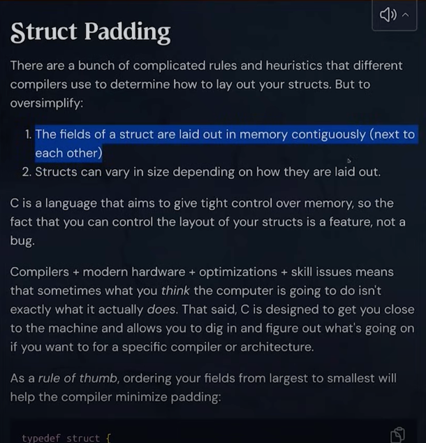

# C Programming and Memory Management

### Boot dev YT

- C Programming and Memory Management - Full Course > https://youtu.be/rJrd2QMVbGM?si=u7LJLZFwFxis4k0z

Up to : 1:02:21 / 4:43:47

You can Build and Run through CodeBlocks or run it locally via the Terminal in VSCode
```
# e.g.
% cd structpad
% gcc -o structpad main.c -std=c99 -Wall -Werror
./structpad
```

Unity Build - include everything in main.c</br>
</br>

Basic C Types & Sizes (This is not the same on every computer in C)</br>
<br/>

### Structs

struct Distance - with logical grouping</br>
<br/>

The order you define the fields matters in C<br/>
<br/>

A struct memory block</br>
</br>

Coordinate Struct - a 12 byte struct</br>
</br>

Mixed type structs</br>
</br>

Struct Padding</br>
</br>

Memory in C</br>
</br>
</br>

Address of an Operator</br>
</br>

An address in memory</br>
</br>

Virtual memory</br>
</br>
</br>
</br>

Pointers</br>
</br>

Copying the value of the original address</br>
</br>

Memory allocation</br>
</br>

Memory location change</br>
</br>

Dereferencing Pointers</br>
</br>