# Dynamic Memory Allocation

RAM 
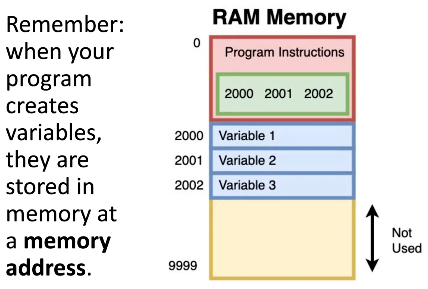 

Stack vs. Heap 
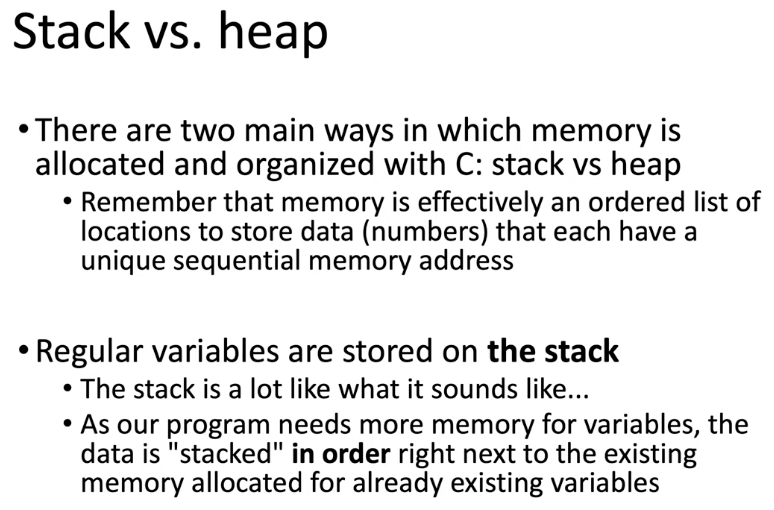 

The Stack 
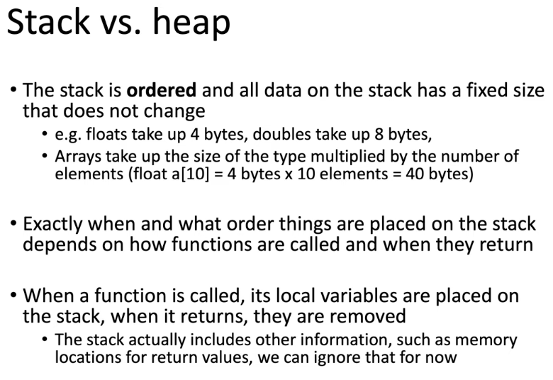 

Stack example 
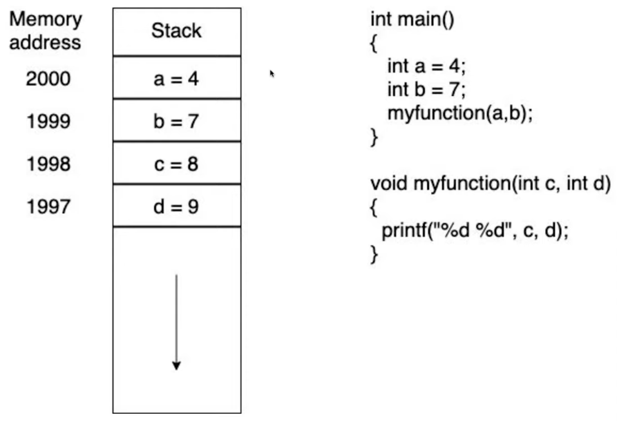 

The Heap - Dynamic allocated memory 
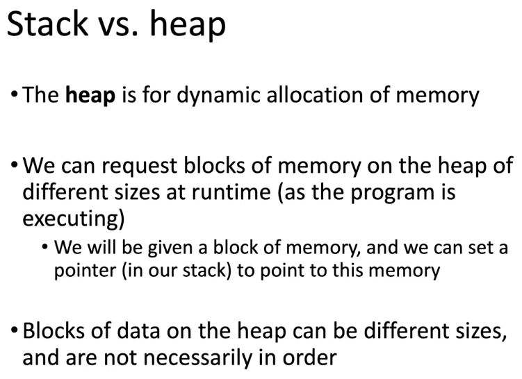 

Malloc - requests a block of memory on the heap 
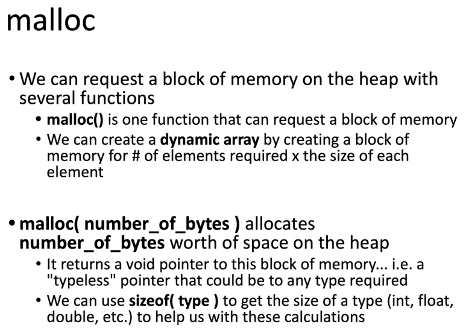 

Stack vs. Heap diagram 
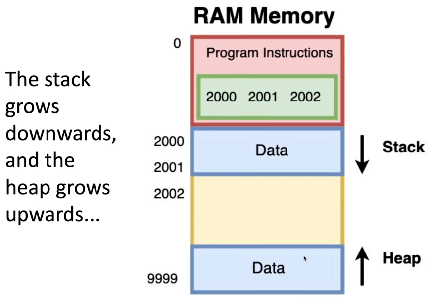 

Heap - free the memory explained 
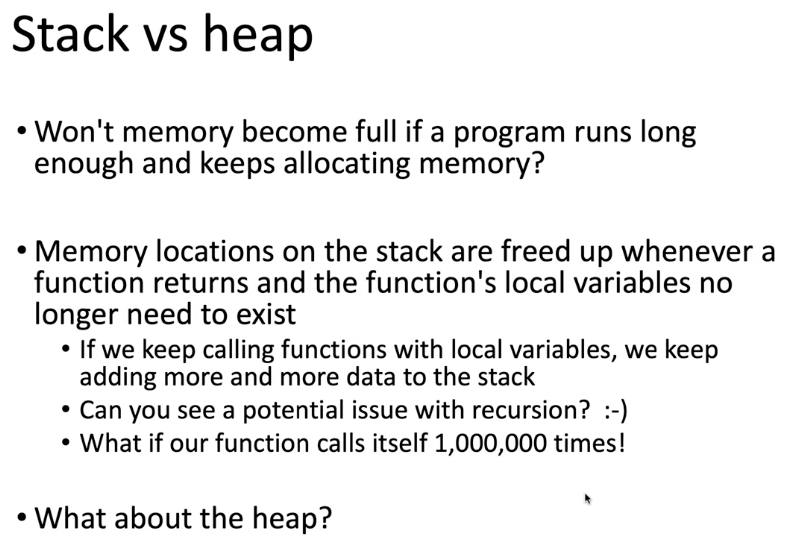 

Manual memory management 
 

Memory Leaks 
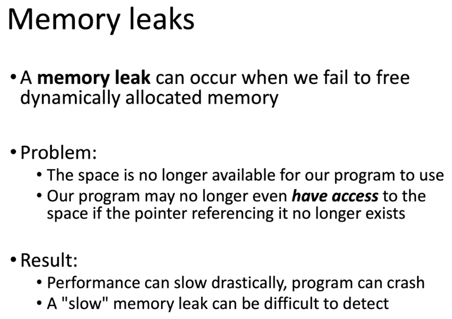 

Manual Memory management issues 
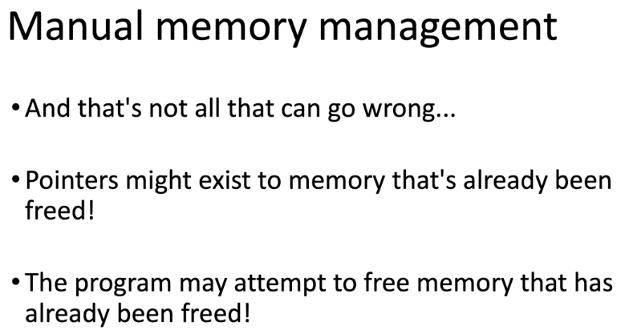 

General Memory management 
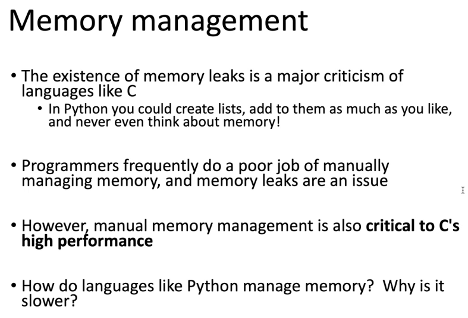 

A Garbage Collector (other languages) 
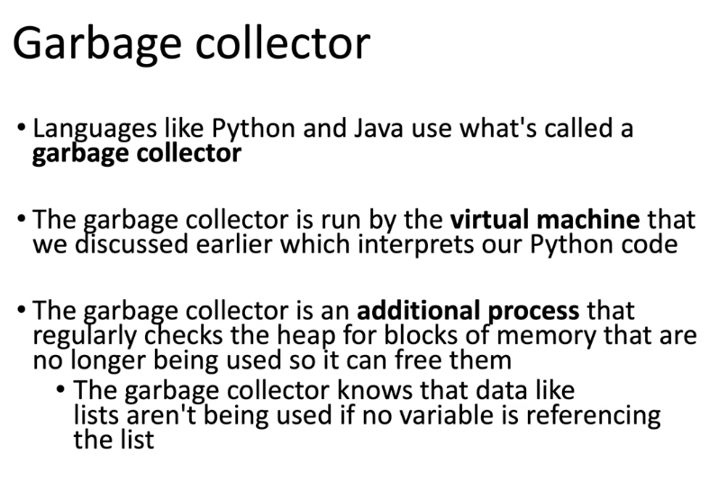 

