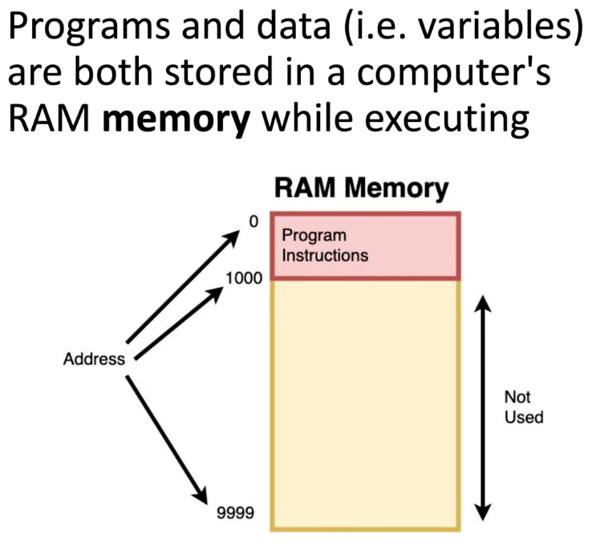
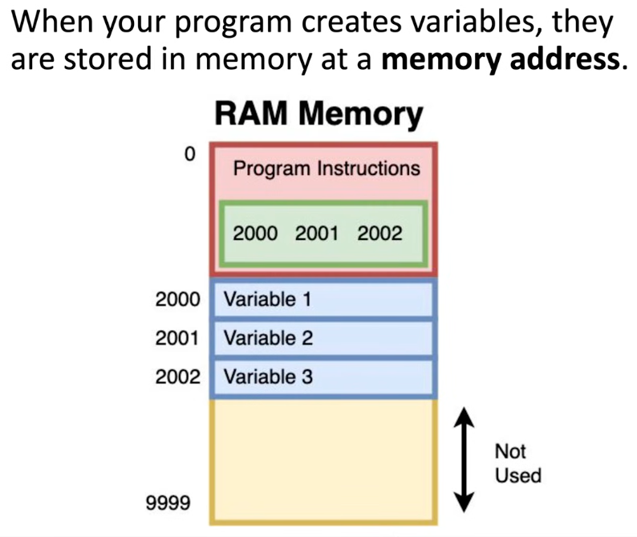
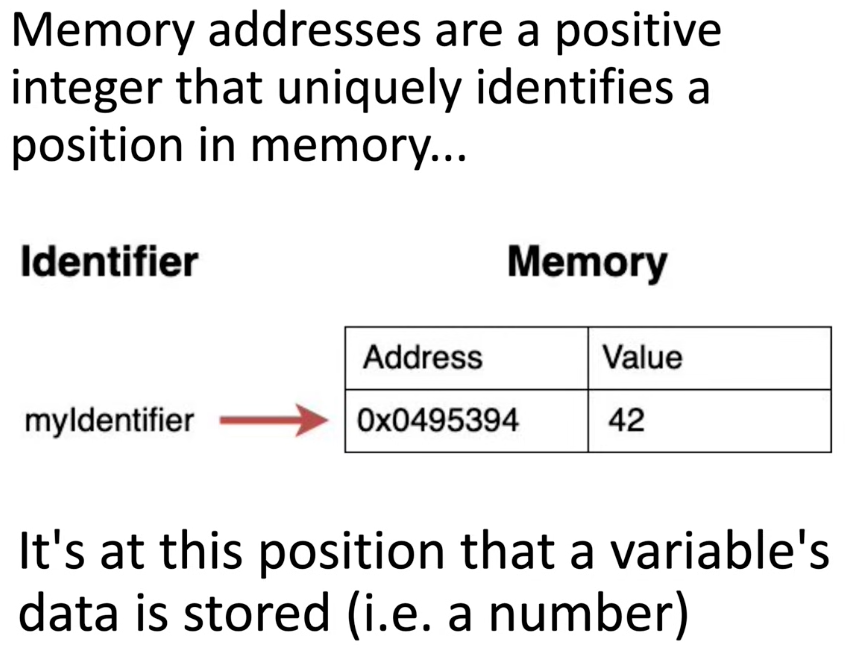
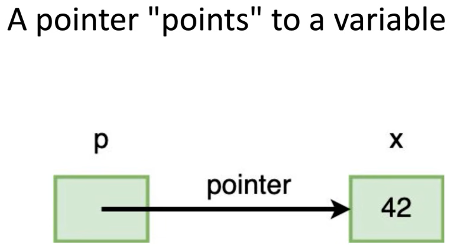
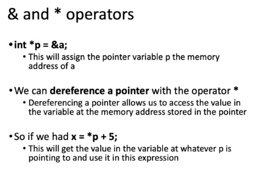
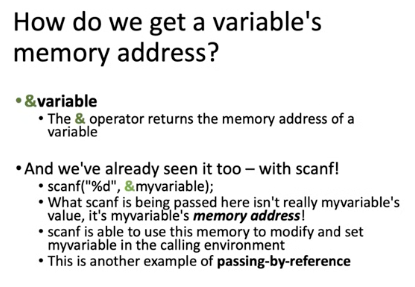

# Function Basics | C Programming Tutorial

- https://www.youtube.com/@PortfolioCourses/featured via Portfolio Courses

C Programming Tutorials
- https://youtube.com/playlist?list=PLA1FTfKBAEX4hblYoH6mnq0zsie2w6Wif&si=NZ3ned6v-JNhMydr

You can Build and Run it locally via the Terminal in VSCode
```
% gcc -o structpad main.c -std=c99 -Wall -Werror
```

## Pointers

Introduction to Pointers</br>
- https://youtu.be/2GDiXG5RfNE?si=kP09dUmtuWZUtjDw

Dynamic Memory Allocations | C
- https://youtu.be/R0qIYWo8igs?si=H-E6mvirCUd_t1F6

</br>

</br>

</br>

</br>

</br>

</br>

Pointers and Derefencing</br>
</br>

</br>