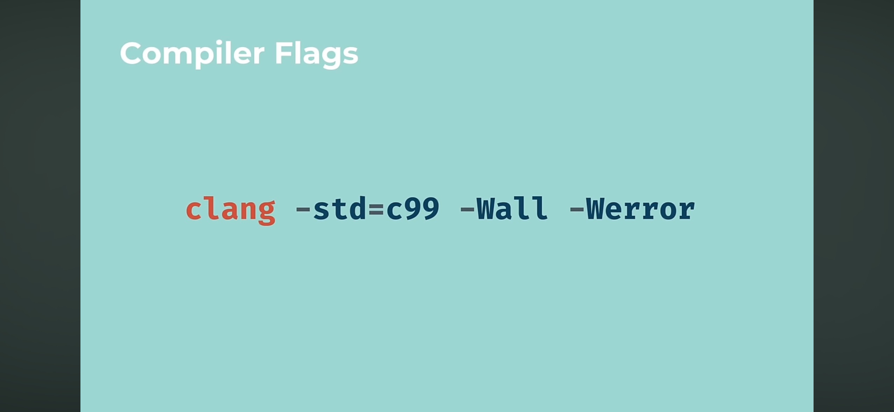

# C Programming

### Learning Assembly along side learning C

- Various video's via Low Level YT Channel and will look at some Tute's by Bootdev or others...

### Learning C (pre Rust prerequisites)

- C Programming Tutorial for Beginners - fCC.org > https://youtu.be/KJgsSFOSQv0?si=jnfBZihhXw-rxVoz 
  - up to : 1:45:36
- Programming and Memory Management - Full Course > https://youtu.be/rJrd2QMVbGM?si=u7LJLZFwFxis4k0z

- Tips for C Programming - https://youtu.be/9UIIMBqq1D4?si=32nxlDDsKw2qR5_2

You can Build and Run through CodeBlocks or run it locally via the Terminal in VSCode
```
# e.g.
% cd structpad
% gcc -o structpad main.c -std=c99 
./structpad

# I will start using this soon
% gcc -o structpad main.c -std=c99 -Wall -Werror
```

C Versions</br>
</br>

Compiler Flags</br>
</br>

C99 stdint.h</br>
</br>

Compound Literals</br>
</br>

Unity Build - include everything in main.c</br>
</br>

A Segmentation Fault</br>
</br>

Cubing a number -  number to the power of 3, i.e.
```
    2^3 -> 2 * 2 * 2
```

Basic C Types & Sizes (This is not the same on every computer in C)</br>
<br/>

